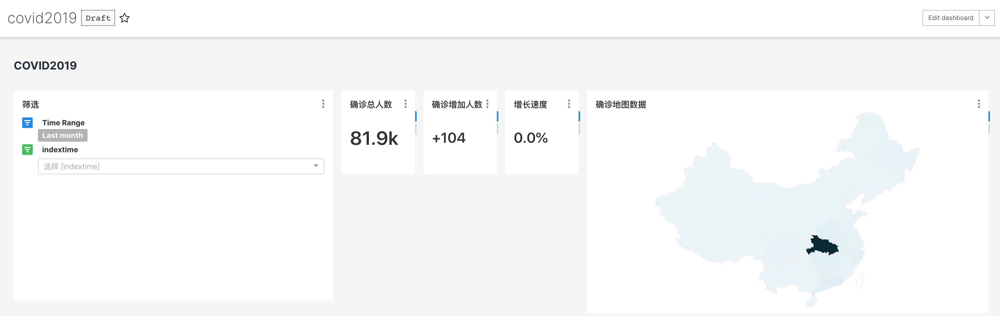

# 2019年新型冠状病毒确诊数据分析项目

### 目的：
分析从1月22日至5月28日的新型冠状病毒感染人数，实现时间段内数据回放。

### 数据来源：
取自[2019新型冠状病毒疫情时间序列数据仓库](https://github.com/BlankerL/DXY-COVID-19-Data)，目前数据更新至5月28日。

### 文件说明：
- [covid_mysql.sql](script/covid_mysql.sql) : MySQL查询语句
- [covid2019.ipynb](script/covid2019.ipynb) : Python数据预处理
- [DXYArea_china.csv](csv/DXYArea_china.csv) : 疫情数据，取自[2019新型冠状病毒疫情时间序列数据仓库](https://github.com/BlankerL/DXY-COVID-19-Data)仓库
- [DXYArea_china_result.csv](csv/DXYArea_china_result.csv) : 数据经过Python预处理后输出结果
- [dashboard.json](json/dashboard.json) : superset dashboard数据导出备份

### 疫情数据预处理说明：
取自仓库的数据部分日期数据丢失，为保证数据连续性：

- 补全缺失日期
- 向前(ffill)、向后(bfill)的方式填充空白日期的数据
- 数据存在一部分误差

### 实现方式：
- Python : PyCharm
- Mysql : Navicat
- superset数据分析平台

### superset仪表盘截图：

  

更新：更新四个指标  

  

 
